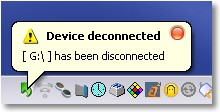
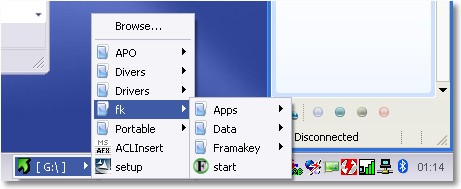
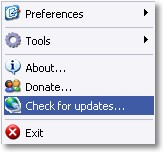

# APO USB Autorun
Enables you to add autorun functionality to your USB drive. It automatically searches for the standard autorun.inf (as used with CDs) and executes it.

This **simple, but very handy** functionality allows you to create an autorun menus in the same way you would for a CD and use it with your USB drive, or launch playlists, html pages and any other type of file as soon as the USB drive is inserted.

In addition to the autorun functionality, the program also allows you to **quickly access the files** on the USB drive(s) from the tray icon menu. APO Usb Autorun now comes with **plugins** to backup/restore folder upon drive insertion.

## What It Does
+ Emulates advanced autorun functionnalities for USB stick drives
+ Enables launching a file upon drive insertion (like could be done for CD-ROM drives)
+ Supports displaying and navigating the disk file system in a structured menu—no need to browse for drive content!
+ System tray icon handles both right and left mouse click:
  - Left click to display drive related actions
  - Right click for a menu to access program options

## Screenshots
System tray icon 

File system browse menu (left click) 

System tray context menu (right click) 

## About
This project used to be available at http://archidune.com/ but is now only accessible via archive.org.
* [Home Page](https://web.archive.org/web/20141216194419/http://archidune.com/)
* [APO USB Autorun Project Page](https://web.archive.org/web/20140826144230/http://archidune.com/usb_intro)
* [APO USB Autorun Help Page](http://www.archidune.com/usb_help)
* [APO USB Autorun Download Page](https://web.archive.org/web/20130214013511/http://www.archidune.com/index.php?id=3)
* [APO USB Autorun v1.6.2.0 (latest version) Download Link](https://web.archive.org/web/20141017143748/http://www.archidune.com/index.php?id=3&d=apo/usb_autorun/setup.exe)

## Other Resources
APO USB Autorun is a computer-based solution.
For a drive-based solution, U3 Launchpad software on some Sandisk and other USB drives would enable the USB drive to appear as both a CD drive and a USB drive, with the CD drive portion launching the autorun.
* [Reinstall or Restore U3 Launchpad Software](https://techjourney.net/reinstall-or-restore-u3-launchpad-software-into-usb-flash-smart-drive/)
* [U3 Launchpad Installer (via archive.org)](https://web.archive.org/web/20151003201509/u3.sandisk.com/download/apps/LPInstaller.exe)
